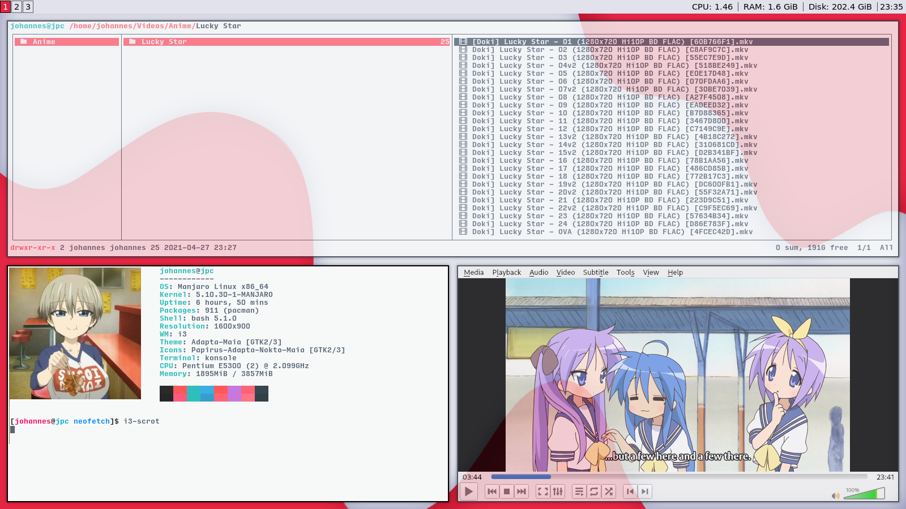
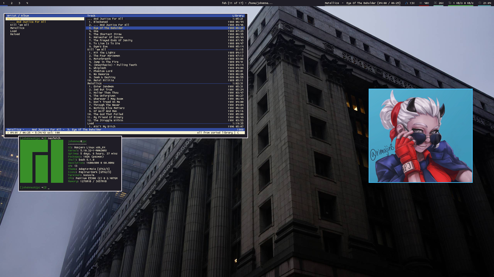

# Chaussettes' Dots

My dotfiles for various setups I cycle between. All hosted here in seperate folders to hopefully keep everything organized in one place.

## Previews

Below are some preview screenies of my rices so far.

DEKAI

JUSTICE

### Fonts
* DEKAI - The dekai rice in the screenshot uses the [Input Mono](https://input.djr.com/) font.
* JUSTICE - The justice rice uses the lemon 8pt font, which I got from [here](https://github.com/Tecate/bitmap-fonts).

Have fun with em.
